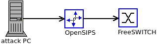
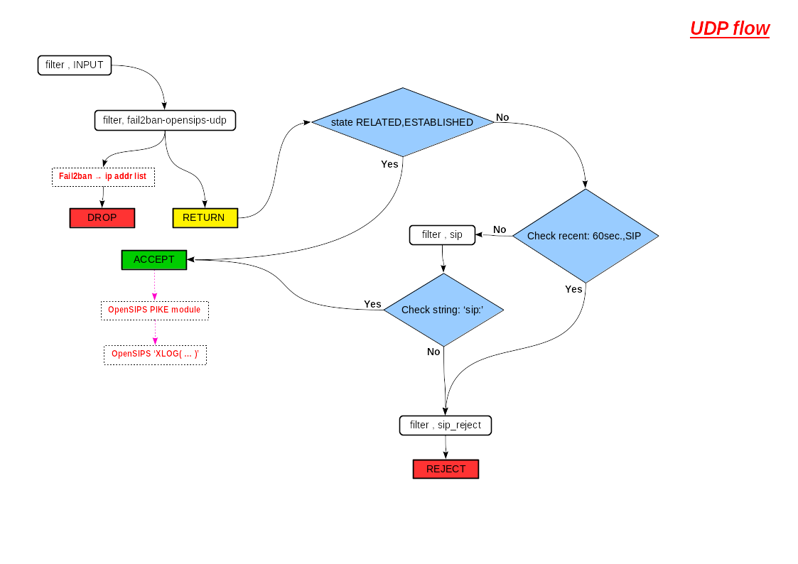

# OpenSIPS security tutorial (part 1) - Flood attacks

* [Introduction](#Introduction)
* [Simple SIP SECURITY LAB](#simple-sip-security-lab)
* [Flood attacks](#flood-attacks)
* [Simple Preventions](#simple-prevention)
* [Links](#Links)

## Introduction

  _**"OpenSIPS is a multi-functional, multi-purpose signaling SIP server used by carriers, 
telecoms or ITSPs for solutions like Class4/5 Residential Platforms, 
Trunking / Wholesale, Enterprise / Virtual PBX Solutions, Session Border Controllers, 
Application Servers, Front-End Load Balancers, IMS Platforms, Call Centers, and many others."**_

It's the first sentense by OpenSIPS project web page.

Really this server can do a lot.


## Simple SIP SECURITY LAB

* OpenSIPS, version 2.4.5 , host.1
* FreeSWITCH, version 1.6.20 , host.2
* Attack PC , host.3
* LAN switch







In this LAB,**OpenSIPS**(host.1) is SIP Router with some SBC functionalities.
Main task is to route calls and registrations from SIP clients to the **FreeSWITCH**(host.2).
For SECURITY issues checking,will use **Attack PC**(host.3).
Over this machine have some my scripts for attacks and others scripts and tools from external projects.
**I'm not sure whether to publish my scripts because with them can be made attacks!**


## Flood Attacks

  The flood attacks are with **SIP incorect**,**SIP correct** or **noSIP** message into all types sockets:

* UDP
* TCP
* TLS


#### UDP noSIP msg flooder (Issue #1)

  For this case,can be used **UDPFlooder**. It generates ~ 8K msg/s.
The messages aren't SIP(don't have SIP headers).
The **OpenSIPS** don't response,but same socket is blocked from this traffic.

#### UDP SIP msg flooder (Issue #2)

  For this case,can be used some SIP message with 'standart' headers(RFC3261),but send with very high load - high sending speed.
For example ~ 7-8K msg/s. Then **OpenSIPS** cannot response and the service state is **'OUT OF SERVICE'**.


#### TCP noSIP msg flooder (Issue #3)

* one connection(socket)
* a lot of connections(sockets)

#### TCP SIP msg flooder (Issue #4)

#### TLS noSIP msg flooder (Issue #5)

#### TLS SIP msg flooder (Issue #6)

#### SIP fuzzing msg flooder (Issue #7)

  The OpenSIPS don't have problems with fuzzing messages. Don't have crash from this.
But these messages can be used as flood attacks(DoS) by attacker.

For example - empty SIP message:

``` sip
BYE sip:@:5060 SIP/2.0
To: <:>
From: <:>
Call-ID:
CSeq: 0
Content-Length: 0

```

See in the **OpenSIPS** log file follow:
```
Nov 20 10:49:01 localhost HPVP-SBC-A[11826]: ERROR:core:parse_cseq: no method found
Nov 20 10:49:01 localhost HPVP-SBC-A[11826]: ERROR:core:parse_cseq: bad cseq
Nov 20 10:49:01 localhost HPVP-SBC-A[11826]: ERROR:core:get_hdr_field: bad cseq
Nov 20 10:49:01 localhost HPVP-SBC-A[11826]: INFO:core:parse_headers: bad header field
Nov 20 10:49:01 localhost HPVP-SBC-A[11826]: ERROR:core:parse_msg: message=<BYE sip:@:5060 SIP/2.0#015#012To: <:>#015#012From: <:>#015#012Call-ID:#015#012CSeq: 0#015#012Content-Length: 0#015#012#015#012>
Nov 20 10:49:01 localhost HPVP-SBC-A[11826]: ERROR:core:receive_msg: Unable to parse msg received from [192.168.127.43:45563]

```

In this case,the empty message cannot relay to the **REQUEST_ROUTE**.
It will crash before that and nothing rules from the config file cannot match.
Therefore,if this case is used as flood,will be have a problem.

## Simple preventions

  For more effective protection,use together follow applications:

* iptables
* fail2ban
* opensips modules and some rules in 'opensips.cfg'

#### Issue #1 prevention - use 'iptables' rules:

  The UDP traffic to SIP port(5060),can be dealed by two parts - **SIP** and **noSIP**.
For to recognize this,can be used the **netfilter** module **'string'**.

Part of the example SIP **iptables** config(/etc/sysconfig/iptables):

``` iptables
# create new chains: sip and sip_reject
iptables -N sip
iptables -N sip_reject

iptables -A INPUT -m state --state ESTABLISHED,RELATED -j ACCEPT

# SIP rules,forwarding to chains 'sip' and 'sip_reject'
iptables -A INPUT -p udp -m recent --name SIP --rcheck --seconds 60 --dport 5060 -j sip_reject
iptables -A INPUT -p udp --dport 5060 -j sip

# Rule for 'Zoiper' keep-alive noSIP packets...maybe and for others softphones
iptables -A sip -p udp -m string --hex-string "|0d 0a 0d 0a|" --from 28 --to 32 --algo bm --dport 5060 -j ACCEPT

# Rule for noSIP messages check
iptables -A sip -p udp -m string --string !"sip:" --algo bm --dport 5060 -j sip_reject
iptables -A sip -p udp -m string --string "sip:" --algo bm --dport 5060 -j ACCEPT
iptables -A sip -p udp --dport 5060 -j sip_reject

iptables -A sip_reject -p udp -m udp -m recent --set --name SIP --dport 5060 -j REJECT

```

#### Issue #2,#4 prevention - use OpenSIPS 'ratelimit' and 'pike' modules:

The **OpenSIPS config** file with **'ratelimit'** rules:

``` opensips
loadmodule "ratelimit.so"
modparam("ratelimit", "timer_interval", 5)
modparam("ratelimit", "expire_time", 1800)
modparam("ratelimit", "default_algorithm", "TAILDROP")

route {
    # monitoring SIP messages example:
    if((is_method("NOTIFY|OPTIONS"))) {
        if(!rl_check("pipe_MON", "400", "TAILDROP")) {
            xlog("L_INFO","MON RATE LIMIT DROP");
            exit;
        }

        # ...
    }

# ...

}

```

You can be checked results from these rules with follow command:

``` bash
opensipsctl fifo rl_list

PIPE::  id=pipe_MON algorithm=TAILDROP limit=400 counter=219
PIPE::  id=pipe_INVITE algorithm=TAILDROP limit=100 counter=2
PIPE::  id=pipe_CANCEL algorithm=TAILDROP limit=50 counter=0
PIPE::  id=pipe_REGISTER algorithm=TAILDROP limit=150 counter=65
PIPE::  id=pipe_HASTOTAG algorithm=TAILDROP limit=100 counter=6
PIPE::  drop_rate=325048

```

The **OpenSIPS config** file with **'pike'** rules:
``` opensips
loadmodule "pike.so"
modparam("pike", "sampling_time_unit", 10)
modparam("pike", "reqs_density_per_unit", 30)
modparam("pike", "remove_latency", 130)
modparam("pike", "pike_log_level", 2)
modparam("pike", "check_route", "pike")


route[pike] {
    if((isflagset(27))||(isflagset(26))) {
        drop;
    }
}

```

You can be checked results from these rules with follow command:

``` bash

opensipsctl fifo pike_list

192.168.127.43

```

The IP address: 192.168.127.43 will be blocked from **'PIKE'** for 130 sec.


#### Issue #7 prevention - use OpenSIPS log and 'fail2ban':

Define follow rule in the **'opensips'** filter file:
``` bash

failregex = \ERROR\:core\:receive_msg\: Unable to parse msg received from \[<HOST>


```


## Links

* [UDPFlooder](http://www.hackingvoip.com/tools/udpflood.tar.gz)
* [Netfilter/iptables project web page](https://netfilter.org/)
* [Fail2Ban MANUAL](https://www.fail2ban.org/wiki/index.php/MANUAL_0_8)
* [RATELIMIT OpenSIPS module](https://opensips.org/html/docs/modules/2.4.x/ratelimit.html)
* [PIKE OpenSIPS module](https://opensips.org/html/docs/modules/2.4.x/pike.html)
* 
